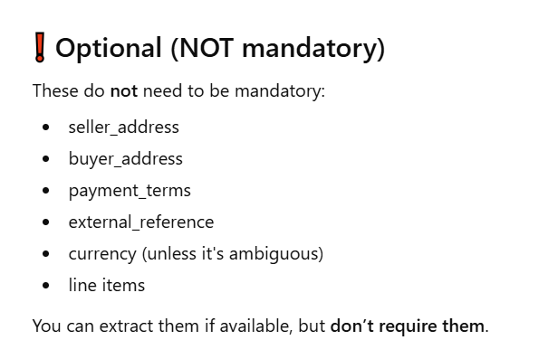

Chatgpt listed line items as a optional field in schema
But Line Items is mandatory to validate the calculations for total Cost and ensuring all the billing 
process was mathematically right.

Chatgpt regex pattern for customer number was incorrect.
"customer_number" : r"Unsere Kundennummer\s*\n\s*(\d+)"
We dont have immediately a new line after Unsere Kundennummer 
SO correct version is this-> adding (.*)
"customer_number" : r"Unsere Kundennummer\s*.*\n\s*(\d+)"

Many incorrect regex patterns

It suggested to create invoice.py in another subdirectory and import that to validate inside validator.py and then match the error codes to string
it is not required for this simple project and we can write much cleaner code in validator.py itself.
